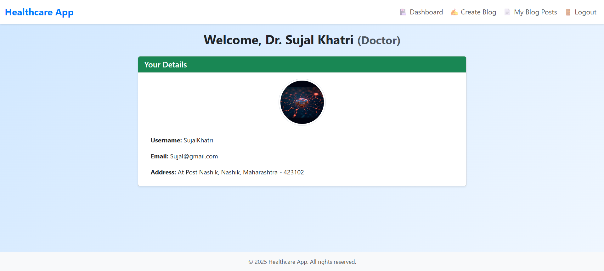

# Healthcare-app

A web-based healthcare management system built with **Django** and **Bootstrap 5**. It supports role-based access for Patients and Doctors with separate dashboards, profile management, and a new integrated blog system.

---

## 🏥 Healthcare App Overview

This project offers a complete healthcare platform where doctors and patients can interact seamlessly. It now includes a **blog system** allowing doctors to create health-related blog posts and patients to read them categorized by topics.

---
## 🚀 Features

### User Management
- 👤 User Signup & Login (with profile picture)
- 🧑‍⚕️ Role-based dashboard (Patient or Doctor)
- 📦 Form validation and error handling
- 🎨 Responsive UI using Bootstrap 5

### Blog System
- 📝 Doctors can create new blog posts with:
  - Title
  - Image upload
  - Category (Mental Health, Heart Disease, Covid19, Immunization)
  - Summary (with 15-word preview limit)
  - Content
  - Draft option before publishing
- 📚 Doctors can view and manage their uploaded blog posts
- 📰 Patients can view all published blogs, sorted by category
- 📄 Blog summaries are truncated to 15 words with ‘...’ if longer

---

## 🛠 Tech Stack

- Backend: **Python 3**, **Django 5**
- Frontend: **HTML**, **Bootstrap 5**, optionally any JS library/framework for blog enhancements
- Database: **MySQL** (updated from SQLite)
- Media: Image uploads handled with Django's media settings

---

## 📂 Folder Structure
healthcare_project/
│
├── accounts/          # User management (models, forms, views) + Blog models integrated here
├── templates/         # HTML templates (includes blog-related templates)
├── static/            # Static files (CSS, JS)
├── media/             # Uploaded profile pictures and blog images
├── db.sqlite3         # Default database (replace with MySQL in production)
├── manage.py
└── requirements.txt

## ⚙️ How to Run Locally

1. Clone the repo:
   ```bash
   git clone https://github.com/yourusername/healthcare-django-app.git
   cd healthcare-django-app
   
Create a virtual environment and activate it:
python -m venv myenv
myenv\Scripts\activate  # Windows

Install dependencies:
pip install -r requirements.txt

Configure MySQL database in settings.py with your credentials:
DATABASES = {
    'default': {
        'ENGINE': 'django.db.backends.mysql',
        'NAME': 'your_db_name',
        'USER': 'your_db_user',
        'PASSWORD': 'your_db_password',
        'HOST': 'localhost',
        'PORT': '3306',
    }
}

Run migrations:
python manage.py migrate

Start the server:
python manage.py runserver

Visit: http://127.0.0.1:8000

📸 Screenshots
### 🏠 Home Page


### 🔐 Login Page


### 📝 Signup Page


### 🏥 Doctor Home


### 🧑‍⚕️ Doctor Dashboard


### ✍️ Doctor Create Blog


### 📚 Doctor View Blog


### 💼 Blog Post Administration


### 🏠 Patient Home


### 🧍 Patient Dashboard


### 📖 Patient View Blog


### 📘 Detailed Blog View


### 🛠️ Users Administration


👨‍💻 Author
Raj Khatri– GitHub
rajkhatri8060@gmail.com
