# 🏥 Healthcare App

A modern web-based Healthcare Management System built with Django (Backend) and React + Vite (Frontend). It features role-based dashboards for Patients and Doctors, full user management, an integrated blog system, and appointment booking with Google Calendar API support.
---

## 🌐 Live Demo
🔗 [View Live Application](https://healthcareapp-frontend.onrender.com)
---
## 🏥 Healthcare App Overview

This full-stack application facilitates seamless interaction between doctors and patients. In addition to managing profiles and roles, it includes:
- A blog platform for doctors to post informative health content
- Patients can explore blogs by category
- Appointment system with calendar integration

---
## 🚀 Features

### User Management
- 👤 User Signup & Login (with profile picture)
- 🧑‍⚕️ Role-based dashboard (Patient or Doctor)
- 📦 Form validation and error handling
- 🎨 Responsive UI using Bootstrap 5

### Blog System
- 📝 Doctors can create new blog posts with:
  - Title
  - Image upload
  - Category (Mental Health, Heart Disease, Covid19, Immunization)
  - Summary (with 15-word preview limit)
  - Content
  - Draft option before publishing
- 📚 Doctors can view and manage their uploaded blog posts
- 📰 Patients can view all published blogs, sorted by category
- 📄 Blog summaries are truncated to 15 words with ‘...’ if longer

---

| Component    | Tech Used                                         |
| ------------ | ------------------------------------------------- |
| Backend      | **Python 3**, **Django 5**                        |
| Frontend     | **React.js**, **Vite.js**, **Bootstrap 5**        |
| Database     | **MySQL**                                         |
| Calendar API | **Google Calendar API**                           |
| Media        | Django Media Settings (for blog & profile images) |

## 📅 Appointment Booking System

Patients can:
- Book appointments with doctors using a dedicated booking interface
Doctors can:
- View scheduled appointments using an interactive Google Calendar integration
- Manage upcoming visits via a calendar dashboard

---

## 📂 Folder Structure
healthcare_project/
│
├── backend/ (Django Project)
│   ├── accounts/       # Auth, Profile & Blog models
│   ├── appointments/   # Appointment models & views
│   ├── templates/      # HTML templates
│   ├── static/         # Static files (CSS, JS)
│   ├── media/          # Uploaded profile & blog images
│   ├── manage.py
│   └── requirements.txt
│
├── frontend/ (React + Vite)
│   ├── src/
│   │   ├── components/     # Reusable components
│   │   ├── pages/          # Page components
│   │   ├── api/            # Axios API calls
│   │   └── App.jsx
│   ├── public/
│   └── vite.config.js

⚙️ Run Project Locally

🖥️ Backend (Django)
# Clone the repo
git clone https://github.com/yourusername/healthcare-django-app.git
cd healthcare-django-app/backend

# Create and activate virtual environment
- python -m venv env
- source env/bin/activate  # On Windows: env\Scripts\activate

# Install dependencies
- pip install -r requirements.txt

# Set up MySQL in settings.py
# Then run:
- python manage.py migrate
- python manage.py runserver

🌐 Frontend (React + Vite)
- cd ../frontend
- npm install
- npm run dev
- Visit: http://localhost:5173

📸 Screenshots
### 🏠 Home Page

### 🔐 Login Page
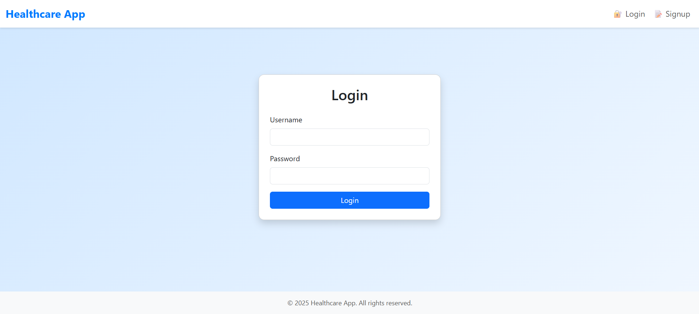

### 📝 Signup Page
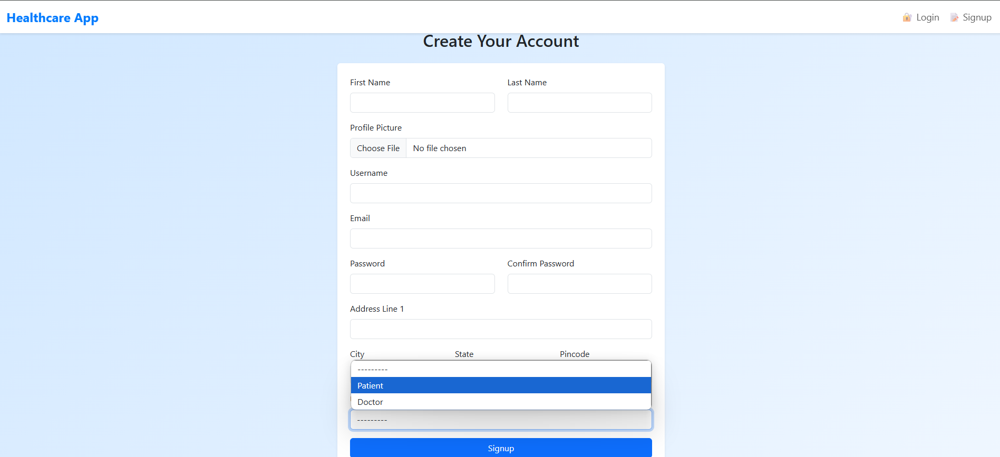

### 🧑‍⚕️ Doctor Dashboard
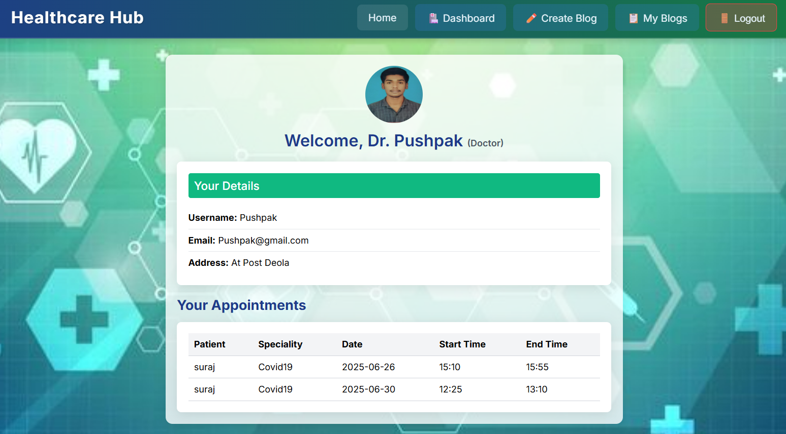

### ✍️ Doctor Create Blog
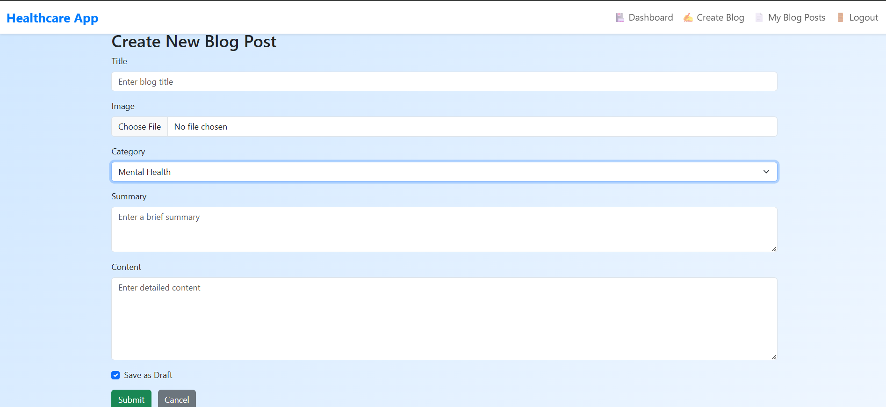

### 📚 Doctor View Blog
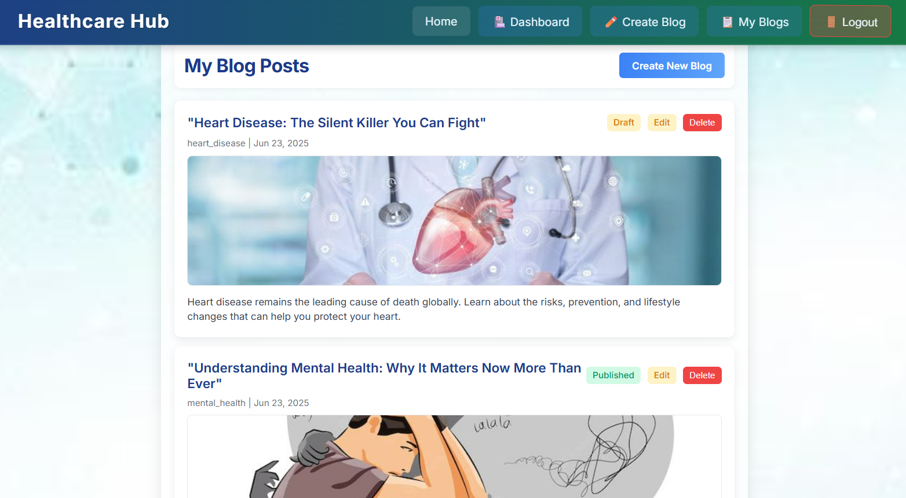

### 💼 Blog Post Administration
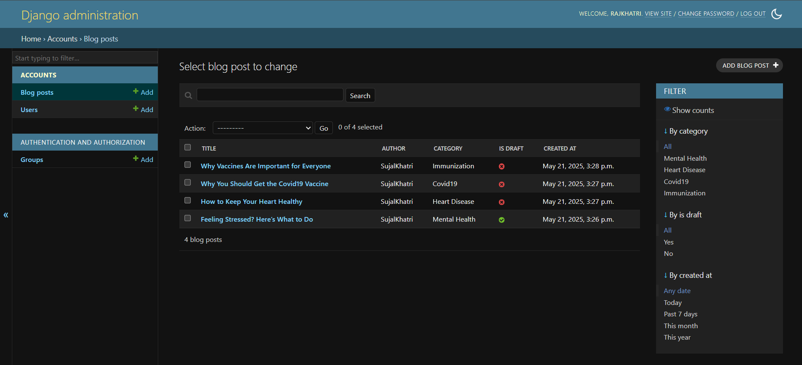

### 🧍 Patient Dashboard

### 📖 Patient View Blog
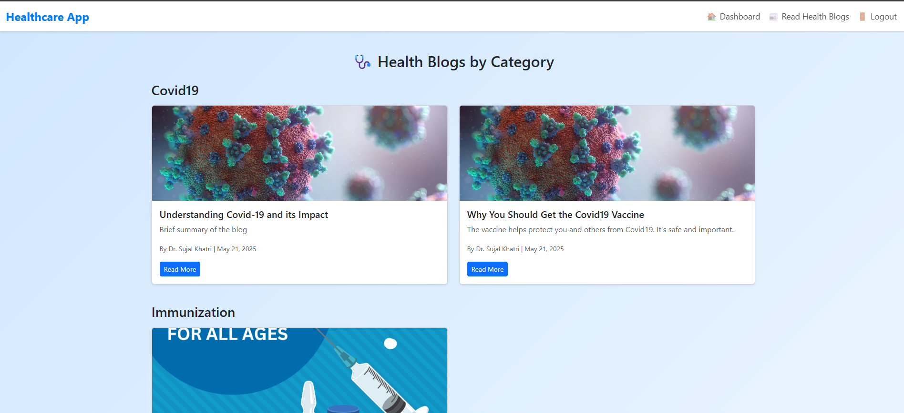

### 📘 Detailed Blog View
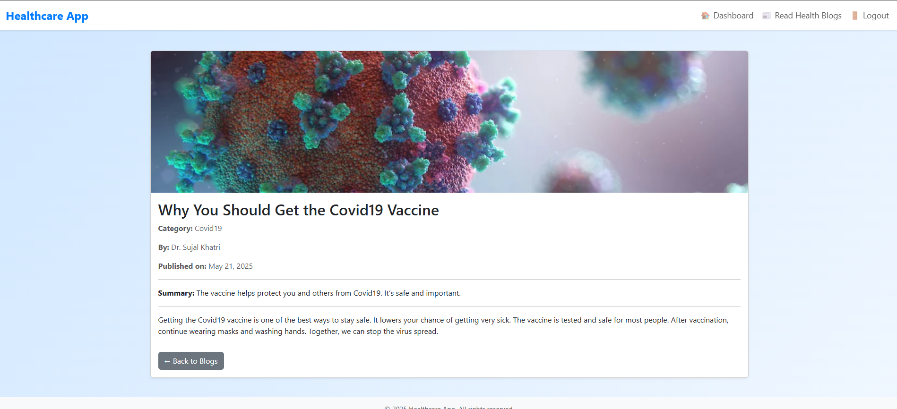

### 📅 Book Appointment
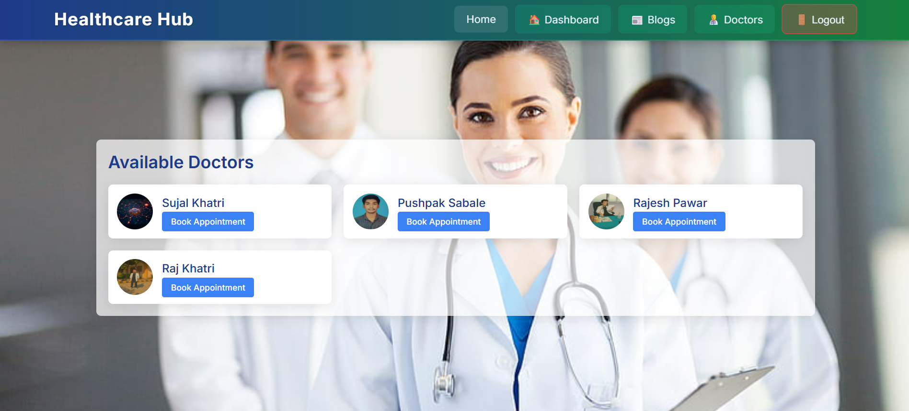
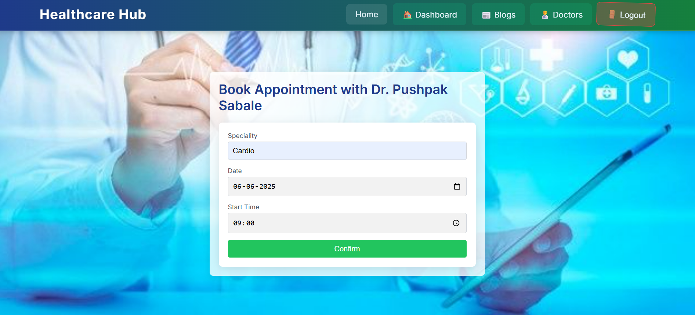
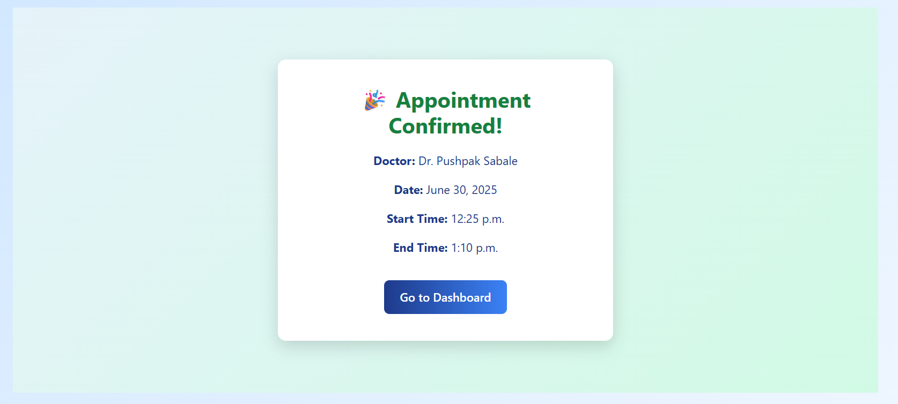

### 📆 Appointment Administration
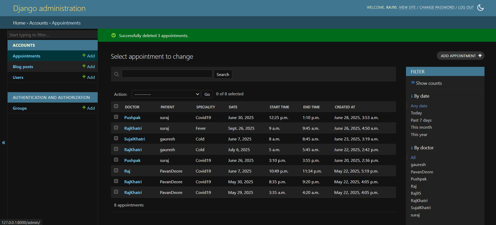

### 🛠️ Users Administration
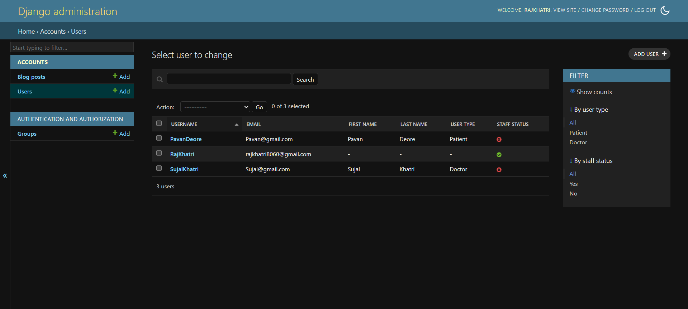

👨‍💻 Author
Raj Khatri
📧 rajkhatri8060@gmail.com
🌐 GitHub: [Github](https://github.com/khatri-raj)
